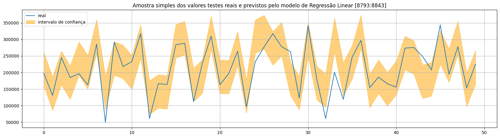
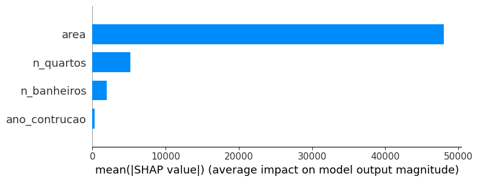
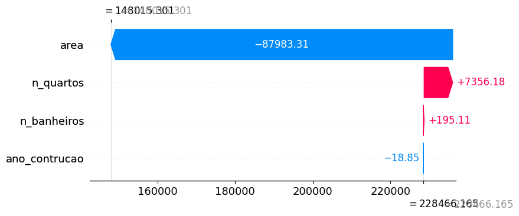
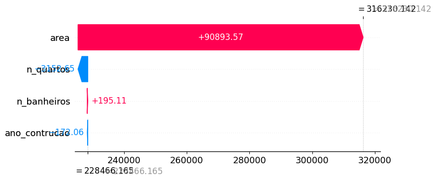

# House Pricing Prediction

Dataset: [Kaggle](https://www.kaggle.com/datasets/muhammadbinimran/housing-price-prediction-data)

1º) Foram feitas algumas alterações no dataset original para melhor entendimento e análise posterior.

---
2º) Escolha de um modelo simples de regressão linear.

```
x_train, x_test, y_train, y_test, scaler, yscaler, FEATURE_NAMES = preparar_dataset()

model = LinearRegression()
model.fit(x_train, y_train)
y_pred = model.predict(x_test)

mae = mean_absolute_error(y_test, y_pred)
mse = mean_squared_error(y_test, y_pred)
rmse = np.sqrt(mse)
r2 = r2_score(y_test, y_pred)

print (f'mae={mae:0.2f}\nmse={mse:0.2f}\nrmse={rmse:0.2f}\nr2={r2:0.2f}')
```

---
3º) Análise do resultado:

  

- O que significa esse gráfico?  
- Significa que foram sorteadas 50 instâncias e plotamos na linha azul o valor real, enquanto que a sobra laranja representa o intervalo do valor predito máximo e predito mínimo. Ou seja, pegamos o valor y_pred e fizemos duas curvas: y_pred + rmse e y_pred - rmse. Essas duas curvas representam uma faixa possível de variação da previsão e não é um intervalo de confiança no sentido estatístico formal (como um intervalo de 95%). Um intervalo de confiança tem uma probabilidade específica de conter o valor real, enquanto o RMSE é apenas uma medida da dispersão dos erros.
- Por fim, essa curva é para ver de forma bem rápida e superficial que o modelo escolhido pode prever bem os preços.  

---
4º) Quanto cada feature interfere no preço médio das predições?  

```
explainer = shap.LinearExplainer(model, x_train)
shap_values = explainer.shap_values(pd.DataFrame(x_test).sample(250))
shap.summary_plot(shap_values, x_test, plot_type="bar", feature_names=FEATURE_NAMES) # Gráfico de barras da importância das features
```

 

---
5º) E quanto cada feature impacta no valor previsto de cada instância (individual)?  

```
n = random.randint(0, len(shap_values) - 1)

shap.plots._waterfall.waterfall_legacy(
    expected_value = explainer.expected_value, 
    shap_values = shap_values[n], 
    feature_names = FEATURE_NAMES
)
```

Muito interessante perceber o quando cada feature impactou para cada resultado individual. 

  

  